# Checkout Payment Gateway

In this repository you will find a basic implementation of a payment gateway built for the Checkout.com interview task.

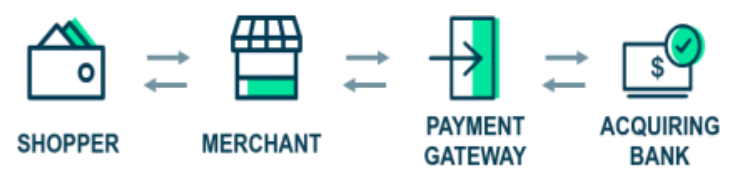

## Introduction

**CoolGateway** is web api built with **.NET 6** and **ASP.Net Core**. It allows a merchant to process a payment through the payment gateway or to retreive the details of a previously made payment.

## How to run

The application targets the [**.NET 6 framework**](https://dotnet.microsoft.com/en-us/download/dotnet/6.0), so make sure to install it. You will also need [Visual Studio 2022](https://visualstudio.microsoft.com/vs/) if you wish to use the IDE.

#### The application is runnable :
- As a self hosted application "CoolGateway" listening on https://localhost:7167 & https://localhost:5167 as described in src\CoolGateway.Web\Properties\launchSettings.json
- On IIS Express
- Or on Docker

#### Database
You can choose to make use of a **local SQL server database** or run on an **in-memory database**. The flag to enable the in-memory database is provided in the `appsettings.json` files (notice that in `appsettings.Developement.json` the in-memory flag is enabled by default) :

```json
{
  "UseInMemoryDatabase": true,
  
}
```

#### Local SQL Server configuration

If you opt for running on a local SQL Server, follow the steps bellow : 

**1. Create a LocalDB instance by running the following command**

```powershell
SQLlocaldb create "MSSQLLocalDB"
```

You can also check it's status by running

```powershell
SQLlocaldb info "MSSQLLocalDB"
```

If it's not running, you can run it with the following command : 

```powershell
SQLlocaldb start "MSSQLLocalDB"
```

**2. Go the location where you have cloned the CoolGateway, and navigate to the WebUI project (where the `appsetting.json` files reside)**

Open a powershell window in that directory, and run the following command :

```powershell
dotnet user-secrets set "ConnectionStrings:CoolConnectionString" "Server=(localdb)\mssqllocaldb;Database=CoolGatewayDb;Trusted_Connection=True;MultipleActiveResultSets=true"
```

This will generate a user secret and store the connection string in it. This secret will **override** the `appsettings.json` `CoolConnectionString` propertie without writting to the file :

```json
"ConnectionStrings": {
    "CoolConnectionString": "Dev"
  },

```

**3. Now all you need to do is run the application, it will automatically create a database called `CoolGatewayDb` inside `(localdb)\mssqllocaldb`.**

On Visual Studio 2022 you can easily switch between the run profiles:

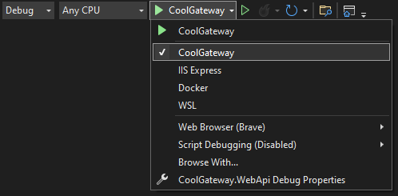

**Tip**

if you wish to connect to the local database through visual studio : Go to `Views -> Server Explorer -> Add a connection` and do as in the screenshot bellow :

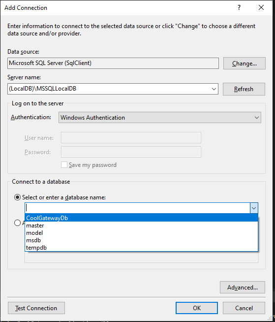


#### Running the tests

Through Visual Studio you can go to `Views -> Test Explorer` and view or run all the tests :

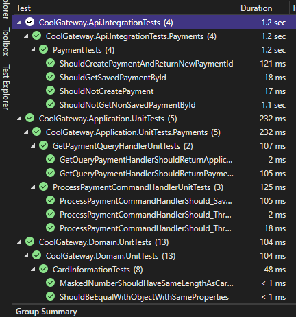


## Test examples 

I started the application as a self hosted app with the in-memory flag set to true, navigated to :

`https://localhost:7167/swagger/index.html`

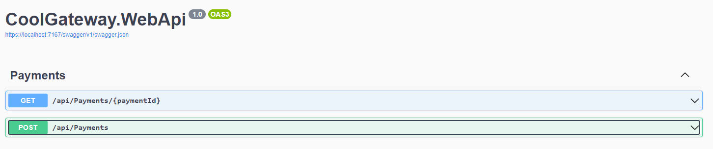

Since the database is empty, we will start by doing a POST payment operation first, you can use the following JSON :

```json
{
  "merchantId": "d5c0319d-f7e5-4922-887e-99c62f33e653",
  "cardNumber": "1234567890123452",
  "cardHolder": "Superman",
  "cardExpiryMonth": 11,
  "cardExpiryYear": 25,
  "cardCvv": 131,
  "amount": 1500,
  "currency": "COOL"
}
```

**Note that the card number has to be valid, and that the only accepted currency by out bank simulation is the "COOL" coins currency**

Now after running we get the following response :

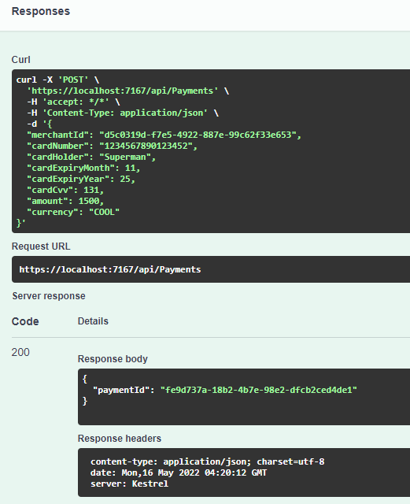

As you can see, in the response we get the GUID that represents the identifier of the payment that was just processed.

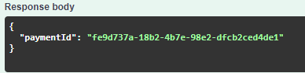

So we can make use of it to perform a GET operation :

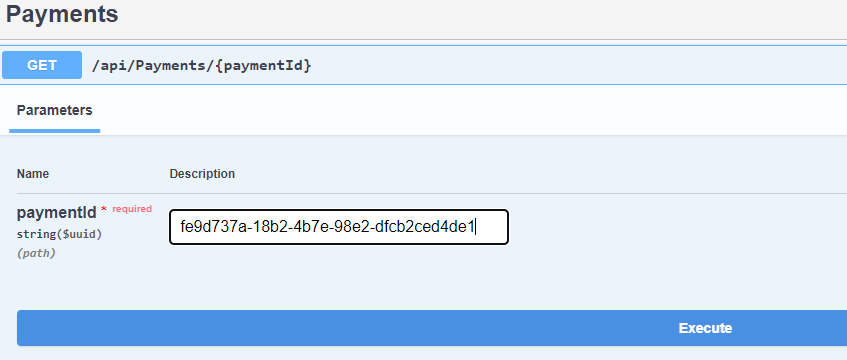

And we get the result that corresponds to the payment details that we did earlier.

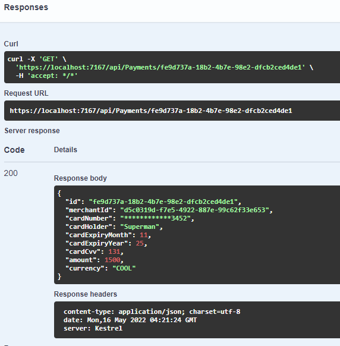

**Notice that the card number is masked**


## Assemptions and areas of improvement

Some of the assemption I made while working on this task is that we deal with credit cards only.

For the improvements and evolution of the project, I can state a few bellow :
- Improve the Domain, this will require having meetings with domain experts.
- Secure the access to the API, and require some form of authorization or key in order to communicate with the CoolGateway
- Use a better way to store secrets (such as connection strings), **AWS Secrets Manager** cloud service would be a great candidate.
- Implement Event Sourcing, and evolve the domain to publish domain events, then make use of some cloud services such as **AWS Event Fork Pipeline** which will help build a fully event driven application and provide things like Event Storage, Backups, Search, Analytics and much more.
- Handle payment methods other than credit cards
- Better security for the transactions of senstive information
- Use DevOps services such as **AWS DevOps** or **Azure DevOps** or **Jenkins** or ...etc
- If the application starts to have many modules make use of Kubernetes for example, and a reverse proxy such as NGINX


## Architecture

The CoolGateway follows a **Domain Drive Design (DDD)** approach, combined with **CQRS** & **MediatR** in order to split the reads and writes.

There are four major layers in the application:

- Domain : holds the domain entities, value objects ..etc
- Application : holds the commands, queries & handlers
- Infrastructure : Implements the persistence and services
- Web API : or the presentation, holds the controller bootstraps the application


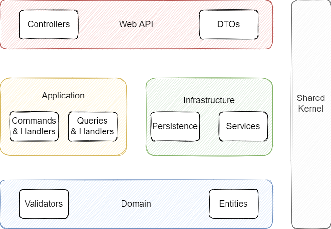


Dependencies flow from the outside towards the center as in the graph bellow : 


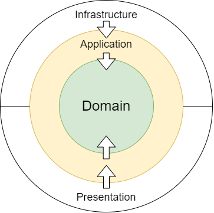


Here is a screenshot of the solution structure :

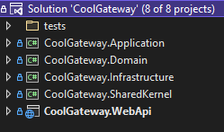

And a screenshot for the structure of the commands & queries : 

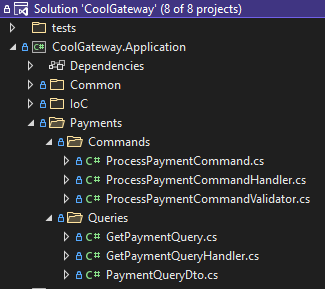


The solution contains 3 more projects for testing : 
- Domain unit tests
- Application unit tests
- Integration unit tests

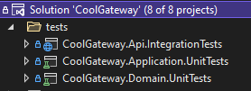


The application log files (serilog) are generated at the solution folder :

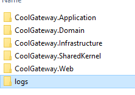
